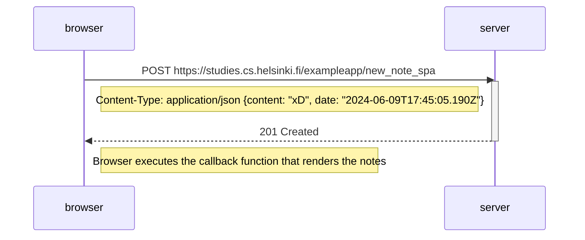

```mermaid
  sequenceDiagram
    participant browser
    participant server

    browser->>server: POST https://studies.cs.helsinki.fi/exampleapp/new_note_spa
    activate server

    Note right of browser: Content-Type: application/json {content: "xD", date: "2024-06-09T17:45:05.190Z"}

    server-->>browser: 201 Created
    deactivate server

    Note right of browser: Browser executes the callback function that renders the notes
```
